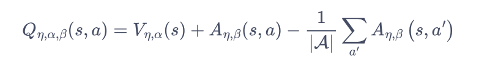

# DQN trial implementation

- A simple trial to implement (Dueling) DQN.
- reference: https://hrl.boyuai.com/chapter/2/dqn%E6%94%B9%E8%BF%9B%E7%AE%97%E6%B3%95/#85-dueling-dqn-%E4%BB%A3%E7%A0%81%E5%AE%9E%E8%B7%B5

---

- Details: To ensure the uniqueness of _state value function_, the following is used to compute $Q$ instead of the naive $Q=V+A$.

  
